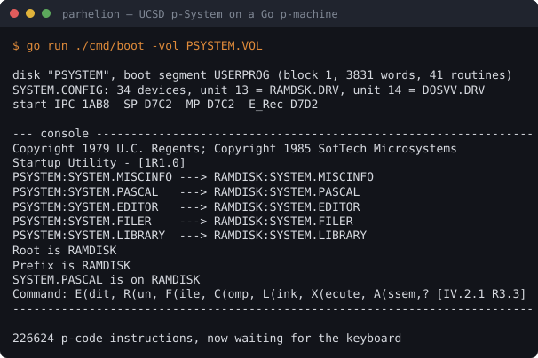
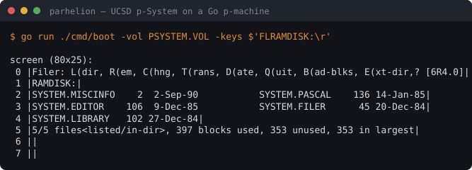

# Parhelion PME

**English** ｜ [日本語](README.ja.md) ｜ [繁體中文](README.md)

A UCSD p-System remade in Go, and the knowledge base that made it possible.

Feed it a 1984 `.VOL` disk image and the p-System boots itself to the command
line, responds to keystrokes, and the Filer lists a directory.
**No original interpreter, no DOS, no 8086 emulator.**

<p align="center"></p>

Those five `--->` lines are the operating system copying its own files onto the
RAM disk. Type at it and it responds:

<p align="center"></p>

Those five files were put on the RAM disk **by the operating system itself**
during boot.

## What this machine can do

| | |
|---|---|
| Execute p-code | **all 210 instructions**, including floats, sets, packed fields, strings |
| Cross-segment call and return | all nine call forms, `EXIT` unwinding through EXITIC, activity and reference counts |
| Concurrency | semaphores, ready queue, priority-based task switching |
| Segment loading | a missing segment raises a segment fault and wakes the OS loader task |
| Disks | `.VOL` image read/write, directory parsing, RAM disk |
| Console | an 80×25 terminal (cursor addressing, erase line, erase screen, scroll); when no key is available it hands control back and resumes at the same instruction |
| Device configuration | parses `SYSTEM.CONFIG`; unit numbers and drivers come from the file |
| Boot | loads the OS's first segment off the disk and lays out SIB, E_Rec, E_Vec, TIB and the outermost activation record |

What runs today: the p-System's **Startup Utility** and **Filer**
(list a directory, change volumes).

## Where the boundary is

The boundary is not one I drew. The interpreter itself keeps a 48-entry table
(image offset `0x1F56`) saying "this one is not p-code, it is host machine code".

| Side | Who does it | Status |
|---|---|---|
| The 210 p-code instructions | `internal/pmachine` | all of them |
| Segment 1's embedded native procedures | `internal/psystem` | 21 of the 26 distinct ones |
| Disk, console, clock, RAM disk | `internal/psystem` | everything boot and the Filer need |
| `NAT` (8086 machine code inside a code segment) | — | **structurally impossible**; it needs an 8086 |

Native procedures not done: `31`/`33` (device mode 3), `32`, `37`, and `47`
(swaps in a different set of float routines — it rewrites the `0x1F56` table
itself). Booting needs none of them.

**Unit 128 is the DOS host's file-system gateway**, which lets the p-System read
and write files on the DOS underneath. A Go host has no DOS beneath it, so the
answer is always "nothing there" — the same kind of boundary as `NAT`, not
something left undone. The shape of the exchange is measured and written down in
[spec 03](docs/30-remake/specs/03-boot.en.md).

One piece is still unexplained: the low end of the data segment. Its origin is
now known — **it is the interpreter's own initialised data**, the first 512
bytes of `SYSTEM.PME.86` copied verbatim into the data segment at the same
offsets, all 37 non-zero words matching. It is the interpreter introducing
itself to the operating system (where SYSCOM lives, a few state offsets, four
native callback entry points). **Only four cells are computed by the
bootstrap**: the address of the boot-parameter block, the physical address of
the data segment, and the task's two stack bounds.

## How we know it is right

Four indicators, each answering a different question. **The first two need no
original**:

| Test | Question | Today |
|---|---|---|
| `TestBootReachesTheCommandLine` | did it boot | reaches the command line, waiting for a key |
| `TestFilerListsTheRAMDisk` | is it usable | `F` → `L` → five files in the right places on screen |
| `TestSelfBootMatchesTheOriginal` | is the p-code the same | **226,623 instructions**, the whole boot |
| `TestSelfBootInitialStateDiff` | was the boot state built right | 409 regions differ, 397 of them host machine code |

The last two put the original alongside ours and compare step by step — that is
this project's method, and where its name comes from. There is also a
**co-simulation** where the original drives and we follow, comparing `IPC`,
`SP`, `TOS` and `E_Rec` on every instruction:

```
$ tools/go.sh run -tags oracle ./cmd/parity -pme .../SYSTEM.PME.86
both sides ran 224999 p-code instructions in agreement
another 1624 were handed to the original (host's job, NOT verified): 70 SCXG1x1617 94 CXGx7
stopped because: the original is no longer executing p-code (idle at the input loop)

173 opcodes used: ...
```

The 1,624 handed over are the two kinds a p-machine is defined to hand over:
segment 1's embedded native procedures, and a segment not yet in memory.
**An unimplemented p-code instruction does not count** — allowing that would
make "not done yet" look like "done".

### Instructions the boot path never reaches

Booting only exercises 173 opcodes; the 16 float instructions are never touched,
because booting an operating system involves no reals. Those are verified by
**single-instruction co-simulation** instead: we choose the instruction bytes and
the operands, write them into the original's code segment and stack, step both
sides once, and compare word by word.

```
ADR = 4.75      MPR = 1.0000000000000001e-305     DVR = 0.3333333333333333
MODI(-17,3) = 1        RND(-3.5) = -4        LESTR("AB","ABC") = 1
```

All 55 cases agree, which brings **co-simulation coverage to 205 of 211**.
The remaining six: `CPI`/`CXL`/`CPF` (they really do jump into another
procedure), `BPT` (deliberately raises a runtime error), `NAT` (structurally
impossible), and `LDCRL` (its operand points into the constant pool, and
planting one there corrupts it).

### What co-simulation does not say

It compares four scalars, not the whole stack. **Corrupting something deep in
the stack that nobody reads afterwards** would go unnoticed.

One independent cross-check came for free: the dates the Filer prints —
`2-Sep-90`, `14-Jan-85`, `20-Dec-84` — decode from the `daccess` fields on disk
(`B429`, `AAE1`, `A94C`) with our own decoder. **Two independent readers, same
answer.**

## The name

It starts with a 1985 Atari ST game. **SunDog: Frozen Legacy** has its game logic
in p-code, not 68000 machine code — reverse-engineering it is where all of this
began.

**The formal name for a sun dog is a parhelion**: ice crystals in the atmosphere
refract sunlight into a second sun, twenty-two degrees from the real one. It is
not the sun, but it is bright enough to be mistaken for it — and **it only
appears while the real sun is up**.

An emulator is exactly that: a likeness convincing enough to be mistaken for the
thing, whose correctness can only be defined by the original. This project's
verification is literally putting the two suns side by side — the same codefile
into the original and into the Go version, and the output must match.

`PME` keeps the original's own filename (`SYSTEM.PME.86`, P-Machine Emulator);
`86` is the 8086. The name commemorates the starting point, but **the subject is
the 1984 DOS 8086 interpreter, not SunDog's 68000 one.**

## Running it

`tools/go.sh` wraps Go in docker; `tools/ci.sh` is the local CI. Checks that
need outside material skip themselves — **and say that they skipped**.

```sh
tools/ci.sh                                   # only what needs no material

PARHELION_CODEFILE=/src/workplace/SYSTEM.PASCAL \
PARHELION_ORIG=~/cht/p-code/psys21/"psystem 1984" \
PARHELION_PME=/src/workplace/SYSTEM.PME.86 \
PARHELION_DOSGOLEM=~/cht/dosgolem-psys \
  tools/ci.sh                                 # everything
```

Original material (`.VOL`, `PSYSTEM.COM`, the extracted `SYSTEM.PME.86`) is
supplied by you; a missing file means a skip. **We do not fabricate stand-ins** —
a silent substitute makes "not verified yet" look like "verified".

| Command | What it does |
|---|---|
| `cmd/boot` | takes a `.VOL` and boots the p-System |
| `cmd/parhelion` | reads a codefile: segment dictionary, routine table, byte sex |
| `cmd/pcode` | disassembles a stretch of p-code |
| `cmd/parity` | co-simulation (needs `-tags oracle`) |
| `cmd/bootdump`, `cmd/whowrote`, `cmd/ioprobe`, `cmd/hostprobe`, `cmd/segprobe` | probes that measure what the original actually does (need `-tags oracle`) |

Underneath the co-simulation layer sits
[`dosgolem`](https://github.com/wicanr2/dosgolem) — the same author's headless
deterministic DOS executor. `oracle/` is the layer that knows about the
p-machine (how to locate the interpreter, how to recognise a dispatch target,
how to read a p-code trace); dosgolem only provides generic capability.
**The side that actually runs does not import it**: the original appears only in
tests.

## Knowledge base

The implementation was written from these, not the other way round.

1. [Fetch and dispatch](docs/10-interpreter/dispatch-and-threading.en.md)
   — an interpreter with no main loop, and how the dispatch table was found
   behind an indirect jump with no displacement.
2. [Interpreter state](docs/10-interpreter/machine-state.en.md)
   — which p-machine registers earn a permanent 8086 register, and where the
   rest live.
3. [Addressing and activation records](docs/10-interpreter/addressing.en.md)
   — the layer between the word world and the byte world, why variable numbers
   start at 1, and the three ways a return can go.
4. [Segment switching](docs/10-interpreter/segment-switching.en.md)
   — `E_Rec`, `SIB`, the code segment header, the procedure dictionary.
5. [Segment 1's embedded native procedures](docs/10-interpreter/native-intrinsics.en.md)
   — where p-code ends and machine code begins. The interpreter draws that line
   itself.
6. [Concurrency and task switching](docs/10-interpreter/tasking.en.md)
   — semaphores, the ready queue, the TIB, and the trick of filling the entire
   dispatch table with one address.
7. [The 256-entry map](docs/10-interpreter/opcode-map.en.md)
   — cell by cell: IV.0 mnemonic, routine offset, instruction count.

Formats: [`.VOL` disk images](docs/20-formats/vol-image.en.md),
[the first 512 bytes of `SYSTEM.PME.86`](docs/20-formats/pme86-header.en.md)
— which are not a header at all, but the interpreter's own initialised data.

The remake: [feasibility](docs/30-remake/feasibility.en.md),
[the spec gate](docs/30-remake/spec-workflow.en.md),
[spec 01 codefile](docs/30-remake/specs/01-codefile.en.md) (`CONFORMED`),
[spec 02 execution core](docs/30-remake/specs/02-pmachine-core.en.md) (`CONFORMED`),
[spec 03 self-boot](docs/30-remake/specs/03-boot.en.md) (`CONFORMED`).

Round-by-round progress, retracted claims and the open-item list are in
[`PLAN.md`](PLAN.md).

## Tools

Everything in `tools/` is self-contained and depends on no other repo:

| File | What it does |
|---|---|
| `read-vol.py` | reads a `.VOL` image: list the directory or extract files |
| `dump-routines-86.py` | inside IDA, disassembles the dispatch table and every routine to JSON, following `call` targets |
| `analyze-dispatch.py` | turns that JSON into statistics or a 256-entry markdown table |
| `screen-svg.py` | turns real program output into the terminal SVGs above |
| `routines-86.json` | the output of the above: 169 routines plus 25 helpers |
| `iv0-opcodes.json` | the official IV.0 mnemonic table |

## Sources

**SofTech, *UCSD p-System and UCSD Pascal Version IV.0 Internal Architecture
Guide*** (1981). A section-by-section digest lives in
[`ucsd-pascal-notes`](https://github.com/wicanr2/ucsd-pascal-notes) under
`docs/50-iv-internals/`, along with the scan.

The subject under test is `SYSTEM.PME.86` from the `psys21` (1984 DOS-hosted
p-System) disk images, sha256 `fe427aa66ca8…`. **This repo contains no original
disk image or executable**, only byte-level conclusions and disassembly output.

General p-machine principles, instruction encoding and the first-principles
derivation of procedure calls live in
[`ucsd-pascal-notes`](https://github.com/wicanr2/ucsd-pascal-notes); this repo
covers the 8086 implementation and the remake.

## Limits

- The "IV.2.1" version identity comes from the disk's release markings;
  **no version number was read out of the file itself**.
- Mnemonics come from the IV.0 manual's appendix. The numbering has been checked
  cell by cell; identical semantics per instruction has not.
- All 169 routines were disassembled, but **not every one has been read**.
  About thirty were read and written up; the rest only appear in table-level
  statistics.
- Disassembly stops at the first unconditional transfer, so each routine covers
  only its main path; code past the jump has to be followed separately.
- Booting exercises **this disk with this device configuration**. A different
  disk or a different configuration walks down paths nothing has verified.

## Licence

Documents and figures are CC BY 4.0. The disassembly output
(`tools/routines-86.json`) is analysis of a program owned by SofTech
Microsystems and its successors, included for technical research.
The licence for the Go implementation is to be decided.
