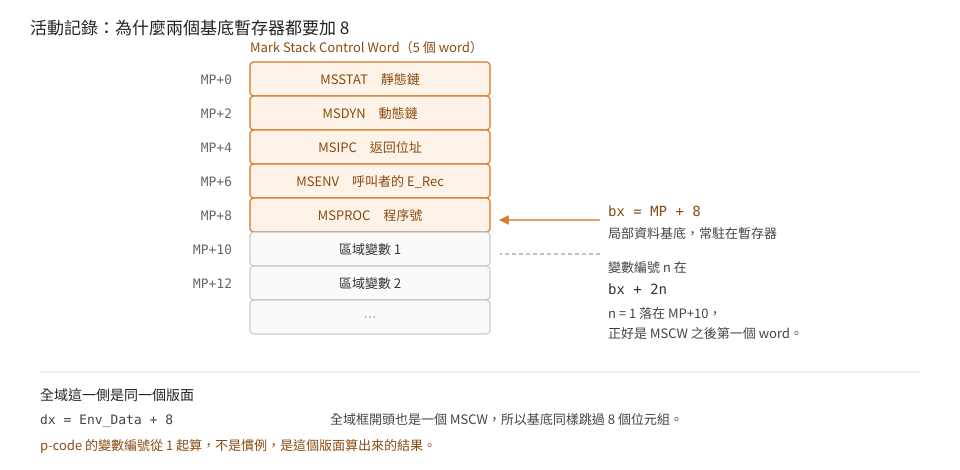

# Addressing: from p-code's world of words to the 8086's world of bytes

**English** ｜ [日本語](addressing.ja.md) ｜ [繁體中文](addressing.md)

p-code addresses in words and numbers variables from 1. The 8086 addresses in bytes.
This page is about the conversion layer between them, and about the actual layout of an
activation record.

> See also: [interpreter state](machine-state.en.md)｜
> [segment switching](segment-switching.en.md)

## Variable-length operands: the same code copied seven times

The big-operand rule on manual p.16: **if the top bit of the first byte is 0, the byte
is the value (0–127); if it is 1, take the low 7 bits as the high byte and read one more
byte as the low byte (0–32767).** The 8086 version expands it inline every time:

```
ac        lodsb
98        cbw
84c0      test al, al
7905      jns  +5              ; top bit 0 → use it directly
247f      and  al, 7Fh
86e0      xchg ah, al          ; low 7 bits become the high byte
ac        lodsb                ; read one more as the low byte
d1e0      shl  ax, 1           ; ← word offset ×2 = byte offset
```

That nine-byte sequence (`84 c0 79 05 24 7f 86 e0 ac`) occurs **19 times** in the file,
literally identical. `LCO`, `LDC`, `LAO`, `XJP`, `RPU`, `MOV` and two addressing helpers
are among the users. Why it was never made a subroutine is visible in the code itself:
the whole thing is 15 bytes, while a `call` plus `retn` costs 4 bytes and two transfers
of control — **on the hottest path, the call is dearer than the duplicated bytes.**

That final `shl ax, 1` is the move that appears 160 times across the interpreter.
p-code says "the 5th word"; the 8086 wants "the 10th byte".

## Activation records: why every base has 8 added to it

When `MOV`/`LOD`/`STR` and their family reach a local variable, the address is
`bx + 8 + 2×number`. Globals are `dx + 2×number`, and `dx` is set to `Env_Data + 8` on a
segment switch. Both add 8 — the length of the Mark Stack Control Word.

Figure 5 of the manual gives the MSCW fields in the order `MSSTAT`, `MSDYN`, `MSIPC`,
`MSENV`, `MSPROC`: five words. `RPU` pops the lot, and the order is plain to see:

```
1140: a12e00    mov ax, word_2E      ; MP
1143: 48 48     dec ax; dec ax       ; sp ← MP−2
1145: 8be0      mov sp, ax
1147: 5f        pop di               ; [MP−2]
1148: 5b        pop bx               ; [MP+0]  MSSTAT
1149: 5b        pop bx               ; [MP+2]  MSDYN  → the new MP
114a: 891e2e00  mov word_2E, bx
114e: 83c308    add bx, 8            ; the new local data base
1151: 891e2600  mov word_26, bx
1155: 5e        pop si               ; [MP+4]  MSIPC
1156: 58        pop ax               ; [MP+6]  MSENV
1157: 5d        pop bp               ; [MP+8]  MSPROC
1158: 0326d400  add sp, word_D4      ; drop the parameters
115c: 892e3200  mov word_32, bp
1160: 85ed      test bp, bp
1162: 7811      js  ...              ; negative procedure number → take EXITIC
```

So once 8 has been added to the base, **variable number 1 lands at `MP+10`, exactly the
first word after the MSCW**. Numbering p-code variables from 1 is not a convention; it
falls out of the layout.

Those two lines `test bp, bp; js` match the manual's description of `RPU`: "if the
procedure number in the MSCW is < 0, return to that procedure's EXITIC rather than to
the MSCW's IPC."

<p align="center"></p>

## Intermediate variables: walking the static chain

The first operand of `LOD`/`STR`/`LDA` is the level difference `DB`. Helper `0x093a`:

```
093a: 32e4      xor  ah, ah
093c: ac        lodsb                ; DB
093d: 91        xchg ax, cx
093e: 8beb      mov  bp, bx          ; ← SLOD1 / SLOD2 enter here
0940: 83ed08    sub  bp, 8           ; back to MP
0943: e305      jcxz +5
0945: 8b6e00    mov  bp, [bp+0]      ; MSSTAT: one level outward
0948: e2fb      loop
094a: <big operand decode>
0955: d1e0      shl  ax, 1
0957: 03e8      add  bp, ax
0959: 83c508    add  bp, 8
095c: c3        retn
```

`bx` is the base with 8 added, so walking the chain means subtracting it first and
adding it back at the end. `SLOD1` and `SLOD2` are the short forms for "level difference
fixed at 1 or 2"; they set `cx` themselves and
**enter at `0x093e`, skipping the three bytes that fetch `DB`** — one piece of code,
two entry points.

Cross-segment globals (`LAE`/`LDE`/`STE`) take another road:

```
15d2: 32e4      xor ah, ah
15d4: ac        lodsb                ; segment number
15d5: 95        xchg ax, bp
15d6: d1e5      shl bp, 1
15d8: 368b3e3a00 mov di, ss:3Ah      ; E_Vec
15dd: 8b2b      mov bp, [bp+di]      ; E_Vec[seg] → E_Rec
15df: 8b6e00    mov bp, [bp+0]       ; E_Rec.Env_Data
15e2: <big operand decode>
15ef: 050800    add ax, 8
15f2: 03e8      add bp, ax
```

The same "add 8". The only difference is that the base is looked up through `E_Vec`
rather than kept resident in `dx`.

## Return: three roads, not one

After `RPU` (@0x1102) has torn the activation record down, **where it jumps depends on
the shape of two values**:

```
1155: pop si            ; MSIPC
1156: pop ax            ; MSENV, discarded
1157: pop bp            ; MSPROC
1158: add sp, word_D4   ; drop the parameters
115c: mov word_32, bp
1160: test bp, bp
1162: js  1175          ; MSPROC negative → take EXITIC
1164: test si, si
1166: jz  11A5          ; MSIPC zero     → return to native code
1168: normal path: continue from MSIPC
```

**A negative MSPROC means this frame is being torn down by an `EXIT`.** Pascal's
`EXIT(proc)` can leave several levels at once; the mechanism is to negate the `MSPROC`
of every frame along the way. On return, the negative sign says: do not go back to
`MSIPC`, jump to that procedure's own **exit code** (`EXITIC`) instead:

```
1175: neg word_32       ; drop the sign
1179: shl bp            ; bp is still negative → the next line is "dictionary base − 2×proc"
117b: add bp, word_36
117f: mov bp, es:[bp]   ; the dictionary entry, which points at DATASIZE
1183: dec bp            ; back one word = EXITIC
1184: shl bp
1186: mov ax, es:[bp]
118a: test si, si
118c: jz  11A1
118e: cmp si, ax
1190: jae 1194          ; the return point is already past the exit code → keep it
1192: mov si, ax
```

That last comparison is the point: **of the two addresses, take the later one.** If the
exit code has already been run, do not jump back into it, or the `finally` part runs
twice.

**A zero MSIPC means native code made this call** (@0x11A5 is a `lret`). There is
nothing on the p-code side to jump to, so control goes back to the machine-code world.

The three roads differ only in the sign and zero-ness of two words. Getting it wrong
raises no error at the time; it just runs somewhere else.

## Packed fields: a lookup is cheaper than arithmetic

Manual p.47 defines a packed field's address as three words on the stack: address,
number of bits, rightmost bit number. The 8086 `LDP`:

```
0a77: 59        pop cx               ; rightmost bit number
0a78: 58        pop ax               ; number of bits
0a79: 5d        pop bp               ; word address
0a7a: 8b6e00    mov bp, [bp+0]
0a7d: d3ed      shr bp, cl           ; shift the field down to bit 0
0a7f: 95        xchg ax, bp
0a80: d1e5      shl bp, 1            ; bit count ×2 as the index
0a82: 2e2386b61f and ax, cs:[bp+1FB6h]
```

At `0x1fb6` sits a ready-made mask table:

```
0000 0001 0003 0007 000f 001f 003f 007f
00ff 01ff 03ff 07ff 0fff 1fff 3fff 7fff ffff
```

Entry n is `(1 << n) − 1`. `STP` takes its mask from the same table, then uses
`ror`/`rol` to rotate the field into place:

```
0a91: 5f        pop di               ; the data to store
0a92: 59        pop cx               ; rightmost bit number
0a93: 5d        pop bp               ; number of bits
0a94: d1e5      shl bp, 1
0a96: 2e8b86b61f mov ax, cs:[bp+1FB6h]
0a9b: 23f8      and di, ax           ; truncate the data to field width
0a9d: f7d0      not ax               ; inverse mask
0a9f: 5d        pop bp               ; word address
0aa0: 8b5600    mov dx, [bp+0]
0aa3: d3ca      ror dx, cl           ; rotate the field down to bit 0
0aa5: 23d0      and dx, ax           ; clear the field
0aa7: 0bd7      or  dx, di           ; drop the new value in
0aa9: d3c2      rol dx, cl           ; rotate back
0aab: 895600    mov [bp+0], dx
0aae: 368b162800 mov dx, ss:28h      ; restore the global base
```

The `ror`/`rol` pair is one shift fewer than "shift left then right", at the price of an
inverse mask — and the inverse mask costs a single `not`.

The 68000 interpreter of the same version has no such table and uses "shift left then
right, turning the shifter into a mask generator" instead. Both are avoiding
"compute a mask at run time", because the field width is a run-time value; the
instruction set decides the means.

`IXP` turns "base plus index" into that triple, and both CPUs get quotient and remainder
from a single division:

```
0a50: 32e4 ac   xor ah,ah; lodsb     ; UB_1: elements per word
0a53: 95        xchg ax, bp
0a54: 32e4 ac   xor ah,ah; lodsb     ; UB_2: field width in bits
0a57: 91        xchg ax, cx
0a58: 58        pop ax               ; index
0a59: 5f        pop di               ; base
0a5a: 33d2      xor dx, dx
0a5c: f7f5      div bp               ; ax = which word, dx = which slot
0a5e: d1e0      shl ax, 1
0a60: 03f8      add di, ax
0a62: 57        push di              ; the triple: address
0a63: 51        push cx              ;             bit count
```

## Limits

- The "19 times" comes from counting the byte sequence across the whole file, so it is
  unaffected by the disassembly cut-off; but sequence matching only recognises the exact
  spelling, and any varied decoding is not counted.
- The stack order of `LDP`/`STP` matches the manual's `Pack-ptr` definition item for
  item, verified on both CPU versions.
- `IXP` computing "which word" by division implies that fields never cross a word
  boundary. How the compiler guarantees that is not pursued here.
