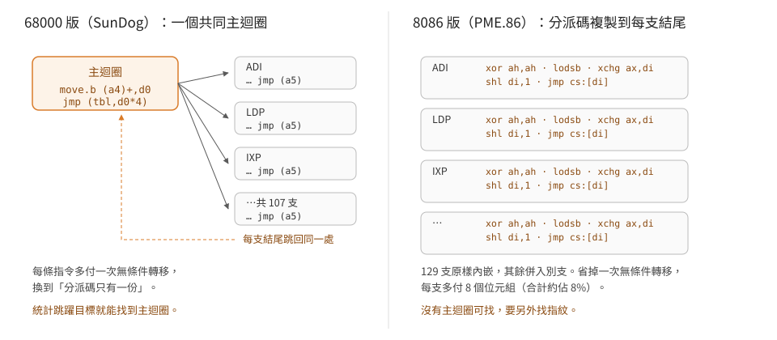

# 取指令與分派：一台沒有主迴圈的直譯器

[English](dispatch-and-threading.en.md) ｜ [日本語](dispatch-and-threading.ja.md) ｜ **繁體中文**

`SYSTEM.PME.86` 是 1984 年 DOS 版 UCSD p-system 的 p-machine 直譯器，16384 個位元組。
它要做的事情很單純——取一個位元組、查表、跳過去、做完再取下一個。
特別的是它**沒有一個叫做「主迴圈」的地方**。

> 延伸閱讀：[直譯器的狀態](machine-state.md)｜[定址與活動記錄](addressing.md)｜
> [256 格對照表](opcode-map.md)

## 分派序列長什麼樣

每一支處理常式的結尾都是同一段 8 個位元組：

```
32e4      xor  ah, ah
ac        lodsb                  ; al ← [ds:si]，si++
97        xchg ax, di            ; di ← opcode
d1e7      shl  di, 1             ; ×2 → 表的位元組索引
2eff25    jmp  word ptr cs:[di]  ; 跳到處理常式
```

`si` 就是 IPC（instruction pointer counter），`lodsb` 一條指令同時完成「讀」與「前進」。
169 支常式裡有 129 支把這段碼**原樣抄在自己的結尾**，剩下的以 `jmp` 併入別支的結尾
或走錯誤路徑。

這種寫法叫 direct threading：**分派碼複製到每一支常式**，省掉「跳回主迴圈」那一次
無條件轉移。1984 年的 8088 上，一次 `jmp` 大約要 15 個時脈；一支典型的處理常式只有
8 條指令，省下的比例並不小。代價是每支多花 8 個位元組——169 支就是 1352 個位元組，
佔整份直譯器的 8%。**用空間換時間，而且是逐支付款。**

同版本的 68000 直譯器（SunDog）選了相反的一邊：常式結尾一律 `jmp (a5)`，
`a5` 常駐指向唯一的主迴圈。所以「統計跳躍目標找主迴圈」這招在 68000 版一次命中，
在 8086 版完全失效——沒有任何一個目標特別突出。

<p align="center"></p>

## 一個省一個位元組的變體

50 支常式的結尾少了 `xor ah, ah`，改成這樣：

```
97        xchg ax, di
ac        lodsb
97        xchg ax, di
d1e7      shl  di, 1
2eff25    jmp  word ptr cs:[di]
```

第一次 `xchg` 把 `di` 搬進 `ax`。這只有在 **`di` 此刻高位元組為零**時才等價——
搬進來的零就當作 `lodsb` 需要的 `ah = 0`。

`SLDC 0` 是最乾淨的例子。`opcode` 為 0 時，分派完 `di` 正好是 0：

```
0319: 57        push di          ; di = 0×2 = 0，推的就是常數 0
      97        xchg ax, di      ; ax ← 0
      ac        lodsb            ; ah 已經是 0
      97 d1e7 2eff25
```

`SLDC` 佔 `0x00`–`0x1f` 三十二格，把「要推的常數」直接編進 opcode。
`0x00` 因為 `di` 恰好為零而有專屬的一支，`0x01`–`0x1f` 共用 `0x0322`。

## 表在哪裡

`jmp word ptr cs:[di]` 沒有位移，字面上表示表在 `cs:0000`；但檔案裡沒有東西長得像表。
反過來從已知的內容找：`BPT`（`0x9e`）在 IV.0 手冊裡的行為是引發執行期錯誤，
而 8086 版把錯誤碼放進 `bp` 再跳共同處理：

```
026e: bd1000    mov bp, 16
0271: eb9c      jmp 0x020f
```

`0x026e` 這個值在整份檔案只出現一次，在偏移 `0x1e92`。若它是 `0x9e` 的表項，
表就在 `0x1e92 − 0x9e×2 = 0x1d56`。用這個基底讀 256 項，全部落在合理的程式碼範圍，
而且逐支反組譯得出來的內容與 IV.0 手冊對得上（見[對照表](opcode-map.md)）。

**表項的值就是檔案偏移**——而執行時它們同時也是 `cs` 相對的位址，因為
**載入器把這 512 個位元組搬到映像的最前面**。

在跑起來的系統裡量過：`SYSTEM.PME.86` 被載到實體 `0x01400`（段 `0x0140`），
映像偏移 `0x000`–`0x1ff` 的內容與磁碟上 `0x1d56` 起的 512 個位元組
**逐位元組相同**，而磁碟上原本放在那裡的檔頭位址表被蓋掉了。

於是三件事同時成立：

- `cs` 指著映像基底，所以 `cs:0000` 就是表的開頭——`jmp word ptr cs:[di]`
  不需要位移。
- 表項是映像相對偏移，當成 `cs:offset` 直接就是常式位址。
- 檔頭那張表只在載入當下有用，之後就不存在了（見
  [檔頭](../20-formats/pme86-header.md)）。

量法是把 `PSYSTEM.COM` 跑起來，用遮罩表（`0x1fb6` 起，純常數、不會被重定位）
當指紋在記憶體裡找到映像基底，再逐位元組比對。

## 256 格的分布

| 分類 | 格數 | 位置 |
|---|---|---|
| 專屬處理常式 | 163 | — |
| `SLDC` 共用（`0x00` 另有一支） | 31 | `0x01`–`0x1f` |
| `SLLA` 共用 | 8 | `0x60`–`0x67` |
| `SCXG` 共用 | 8 | `0x70`–`0x77` |
| 未實作（錯誤 11） | 44 | `0x40`–`0x5f`、`0xaa`、`0xaf`、`0xf5`–`0xfe` |
| 錯誤 14 | 1 | `0xff` |
| 錯誤 16 | 1 | `0x9e`（`BPT`） |

相異目標 169 個。全部反組譯成功，指令數中位數 8，只有 `MPR`（`0x24e1`）與
`DVR`（`0x262a`）超過 80 條的截斷上限。

## 手邊的統計

2026 條指令裡（不含被截斷的部分）：

| 暫存器 | 出現次數 | | 指令 | 次數 |
|---|---|---|---|---|
| `ax` | 746 | | `mov` | 258 |
| `di` | 571 | | `xchg` | 241 |
| `bp` | 347 | | `lodsb` | 177 |
| `cs` | 135 | | `jmp` | 166 |
| `cx` | 130 | | `shl` | 160 |
| `si` | 129 | | `pop` | 151 |

`xchg` 排到第二名不是巧合。8086 的 `xchg ax, reg` 只有一個位元組，
而 `mov` 要兩個；在一支八條指令的常式裡，這種一個位元組的差別會被複製 169 次。
`shl` 排第五也有結構性的理由——p-code 的位址單位是 word，8086 的是位元組，
**每一次位址計算都要乘二**。

## 邊界

- 反組譯的結束判準是「任何無條件轉移」，所以落在 `jmp` 之後的碼不會被收進來。
  `MPR`、`DVR` 兩支被 80 條上限截斷，本篇的指令統計因此偏低。
- 「129 支內嵌分派碼」是比對結尾 5 條指令的位元組得到的，沒有處理「結尾在中途分岔」
  的情形。
