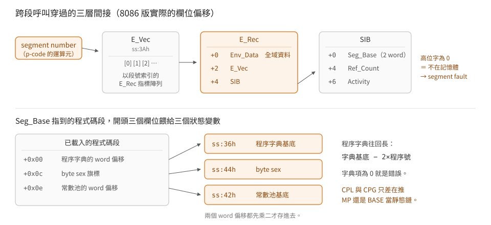

# 段的切換：E_Rec、SIB 與程式碼段的表頭

p-machine 一次只有一個「目前的段」。跨段呼叫要換掉程式碼基底、常數池基底、
全域資料基底，還要更新兩個計數器讓作業系統知道哪個段可以被換出去。
這一篇把 8086 版做這件事的那 43 條指令拆開。

> 延伸閱讀：[直譯器的狀態](machine-state.md)｜[定址](addressing.md)

## 三層間接

手冊 p.37 的 `E_Rec` 是段的執行期描述子。8086 版實際用的欄位偏移：

| 偏移 | 內容 | 憑什麼 |
|---|---|---|
| `+0` | `Env_Data`，段的全域資料基底 | `LAE` 助手拿它加 8 再加變數偏移；切段時寫進 `word_30`，加 8 後成為 `dx` |
| `+2` | `E_Vec`，**以 segment number 索引的 `E_Rec` 指標陣列** | `CXL` 助手 `bp = segnum×2; bp = [bp + ss:3Ah]`，而 `ss:3Ah` 就是這一格 |
| `+4` | `SIB` | 切段時寫進 `word_34`，之後對它 `+4`／`+6` 做計數，語意對得上手冊的 `Ref_Count` 與 `Activity` |

手冊的 Pascal 宣告寫的是 `Env_Data`、`Env_SIB`、`Env_Vect`。
**這份實作的第二、三欄與那個順序相反。** 兩項獨立證據都指向 `+2` 是指標陣列：
它被 segment number 乘二索引，取出來的東西再被當成 `E_Rec` 解引用。

<p align="center"></p>

## 切段那一段碼

`0x0fab` 有三個入口，對應三種「已經知道多少資訊」的呼叫者：

```
0fab: d1e5      shl bp, 1            ; 入口一：bp = segment number
0fad: 032e3a00  add bp, word_3A      ;   查 E_Vec
0fb1: 8b6e00    mov bp, [bp+0]
0fb4: a13e00    mov ax, word_3E      ; 入口二：bp = 目標 E_Rec
0fb7: a34000    mov word_40, ax      ;   記下舊的 E_Rec
0fba: 892e3e00  mov word_3E, bp      ; 入口三：不記舊的
0fbe: 8b5600    mov dx, [bp+0]       ; Env_Data
0fc1: 89163000  mov word_30, dx      ;   → BASE
0fc5: 83c208    add dx, 8            ;   → 全域資料基底（常駐在 dx）
0fc8: 89162800  mov word_28, dx
0fcc: 8b4602    mov ax, [bp+2]
0fcf: a33a00    mov word_3A, ax      ; E_Vec
0fd2: 8b7e04    mov di, [bp+4]
0fd5: 893e3400  mov word_34, di      ; SIB
0fd9: 8b4502    mov ax, [di+2]
0fdc: 3d0000    cmp ax, 0
0fdf: 7439      jz  return           ; ← ZF = 段不在記憶體
      ...                            ; 算出程式碼段的 8086 段值
0ff7: 8ec0      mov es, ax
0ff9: a32a00    mov word_2A, ax
0ffc: 33ed      xor bp, bp
0ffe: 268b460c  mov ax, es:[bp+0Ch]
1002: a34400    mov word_44, ax      ; byte sex
1005: 268b4600  mov ax, es:[bp+0]
1009: 268b6e0e  mov bp, es:[bp+0Eh]
100d: d1e0      shl ax, 1
100f: a33600    mov word_36, ax      ; 程序字典基底
1012: d1e5      shl bp, 1
1014: 892e4200  mov word_42, bp      ; 常數池基底
1018: 85ed      test bp, bp
101a: c3        retn
```

`CXL` 從入口一進來（只知道段號），`CPF` 從入口二，`RPU` 從入口三。
**三個入口共用同一段尾巴**——這是把「切段」寫成一支常式、再讓不同的呼叫者
跳過前面幾條的做法，和 `SLOD1`／`SLOD2` 共用定址助手是同一種手法。

返回值靠 ZF：`0x0fdf` 那條 `jz` 直接跳到 `retn`，所以呼叫端的 `jz` 就是
「段不在記憶體，要發 segment fault」。`CXL` 的 `call 0fab; jz 0x143d` 就是這樣接的。

## 程式碼段的表頭

上面最後幾條指令從**已經載入的程式碼段開頭**讀三個值：

| 段內位元組偏移 | 內容 |
|---|---|
| `0x00` | 程序字典的 word 偏移；直譯器乘二存進 `word_36` |
| `0x0c` | byte sex 旗標；1 表示與主機相同 |
| `0x0e` | 常數池的 word 偏移；乘二存進 `word_42` |

程序字典**往回長**。呼叫助手 `0x101b`：

```
101b: 8f06d600  pop word_D6          ; 呼叫端的返回位址
101f: 8f06da00  pop word_DA          ; 呼叫端推的靜態鏈值
1023: 892ed800  mov word_D8, bp      ; bp = 程序號
1027: d1e5      shl bp, 1
1029: f7dd      neg bp
102b: 032e3600  add bp, word_36      ; 字典基底 − 2×程序號
102f: 268b7e00  mov di, es:[bp+0]
1033: 85ff      test di, di
1035: 7503      jnz  繼續
1037: e9f9f1    jmp  錯誤
```

字典項為 0 就是錯誤。這解釋了 `CPL` 與 `CPG` 為什麼只差一行：

```
CPL: ff362e00  push word_2E      ; MP —— 呼叫者自己的框當靜態鏈
CPG: ff363000  push word_30      ; BASE —— 全域框當靜態鏈
```

兩支的其餘部分完全相同，都接 `call 0x101b`。

## 兩個計數器

跨段呼叫成功之後（助手 `0x10db`）：

```
10db: 8b2e2e00  mov bp, word_2E      ; MP
10df: 8b3e4000  mov di, word_40      ; 舊的 E_Rec
10e3: 897e06    mov [bp+6], di       ; MSENV ← 舊的 E_Rec
10e6: 368b6d04  mov bp, ss:[di+4]    ; 舊段的 SIB
10ea: e80800    call 0x10f5          ;   [SIB+6] ← ++計數器
10ed: 8b2e3400  mov bp, word_34      ; 新段的 SIB
10f1: ff4604    inc word ptr [bp+4]  ;   Ref_Count++
```

`RPU` 做相反的事：`dec word ptr [bp+4]`。`0x10f5` 只有五條：

```
10f5: 36a11001  mov ax, ss:110h
10f9: 40        inc ax
10fa: 36a31001  mov ss:110h, ax
10fe: 894606    mov [bp+6], ax
1101: c3        retn
```

手冊說 `Ref_Count` 是「未完成的跨段呼叫數」，`Activity` 是「依使用次數累積、隨時間增加」。
`+4` 與 `+6` 的行為分別對上這兩個描述。以手冊宣告的欄位順序推算，
`Ref_Count` 應該在 `+2`、`Activity` 在 `+4`——**兩邊都差兩個位元組，
表示 8086 版的 `Seg_Base` 佔兩個 word 而不是一個。**

那也符合這台機器的處境：一個 16-bit 的位址指不到 64 KB 以外，
而 code pool 裝不進 64 KB。助手 `0x1bee` 把那兩個 word 併成 8086 的段值：

```
1bee: 85ed      test bp, bp
1bf0: 7416      jz  → ax = ss
1bf2: 8b4602    mov ax, [bp+2]
1bf5: 8b6e00    mov bp, [bp+0]
1bf8: 51        push cx
1bf9: b104      mov cl, 4
1bfb: d3e8      shr ax, cl           ; 低位字 >> 4
1bfd: 81e50f00  and bp, 0Fh          ; 高位字只有 4 個 bit 有意義
1c01: d3cd      ror bp, cl           ;   << 12
1c03: 59        pop cx
1c04: 0bc5      or  ax, bp
1c06: 7502      jnz →
1c08: 8cd0      mov ax, ss           ; 算出 0 就退回直譯器自己的段
1c0a: c3        retn
```

也就是 20-bit 位元組位址存成 `{高 4 bit 的 word, 低 16 bit 的 word}`，
要用的時候右移四位變成 paragraph。零值代表「在直譯器自己的段裡」。

## `Seg_Base` 到底怎麼算成段值

`SIB` 開頭那兩個 word 不是一個位址，是**一個指標加一個偏移**：

| word | 內容 |
|---|---|
| `Seg_Base+0` | 指向 Codepool 基底的指標，**相對直譯器的資料段**（`ss`） |
| `Seg_Base+2` | 那一段在 Codepool 裡的**位元組偏移** |

```
段值 ＝ paragraph(Codepool 基底) ＋ (池內偏移 ÷ 16)
```

指標為 0 表示那一段就在直譯器自己的段裡（`0x1bee` 的 `test bp,bp; jz`）。

在跑起來的系統裡量到的一組（`ss` ＝ `0x04d1`，`ss:11ac` ＝ `{0001, 4d10}`，
所以 Codepool 基底 ＝ paragraph `0x14d1`）：

| 段 | `Seg_Base` | 算出來 | 實際載在 |
|---|---|---|---|
| `KERNEL` | `11ac 0020` | `0x14d1 + 0x002` | `0x14d3` |
| `CUPOPS` | `11ac 1420` | `0x14d1 + 0x142` | `0x1613` |
| `GETCMD` | `11ac 2a20` | `0x14d1 + 0x2a2` | `0x1773` |
| `MSGOPS` | `11ac 4620` | `0x14d1 + 0x462` | `0x1933` |
| `COMMANDI` | `11ac b420` | `0x14d1 + 0xb42` | `0x2013` |
| `SMALLCOM` | `11ac ce20` | `0x14d1 + 0xce2` | `0x21b3` |
| `REALOPS` | `11ac d820` | `0x14d1 + 0xd82` | `0x2253` |
| `USERPROG` | `0000 d800` | `ss + 0xd80` | `0x1251` |

八個全部命中。最後一列是指標為 0 的情形。

**`0x0fdf` 那個零檢查看的是第二個 word**（池內偏移），偏移為 0 就是段不在記憶體——
`SCREENOP`、`LOCK`、`FILEOPS` 這些當下沒載入的段，兩個 word 都是 0。

`SIB` 其餘欄位也一併對上了。`Seg_Name` 讀出 `"KERNEL  "`（byte `+12`）、
`Seg_Leng` 讀出 2152（`+20`），與手冊 p.34 的宣告順序完全一致——
只要把 `Seg_Base` 算成兩個 word：

## 內嵌在直譯器裡的 33 支程序

手冊 p.66 提到 segment 1 的程序碼可能直接做在直譯器裡。`CXG` 的前半段就是在查這件事：

```
13f4: 83fd01    cmp bp, 1            ; 段號是 1 嗎
13f7: 751a      jnz 一般路徑
13f9: 8b3c      mov di, [si]         ; 偷看程序號（不前進）
13fb: 81e7ff00  and di, 0FFh
13ff: 83ff2f    cmp di, 2Fh
1402: 7f0f      jg  一般路徑         ; > 47 → 一般路徑
1404: d1e7      shl di, 1
1406: 2e8bbd561f mov di, cs:[di+1F56h]
140b: 83ff00    cmp di, 0
140e: 7403      jz  一般路徑         ; 這一格沒有內嵌實作
1410: 46        inc si
1411: ffe7      jmp di               ; 直接跳進機器碼
```

`0x1f56` 起的 48 格裡有 **33 格非零**：4、14–16、18–34、36–47。
另外七對指到同一個位址（18 與 40、19 與 41、31 與 42、33 與 43、34 與 44、
36 與 45、39 與 46），所以相異的機器碼實作是 26 支。

`mov di, [si]` 讀的是一個 word，`and di, 0FFh` 只留低位元組——
偷看程序號但不前進，因為走一般路徑時還要由那條路徑自己去讀這個位元組。
68000 版做同一件事用 `move.b (a4),d1`，上限是 `0x30` 而不是 `0x2f`。

## 邊界

- `Seg_Base` 的算法是在跑起來的系統裡量出來的（八個段全部命中），
  不是手冊寫的。手冊只說 `Seg_Base` 是 `Mem_Ptr`。
- `0x1bee` 讀的指標相對 `ss`。原本從碼上看像是相對 `es`，
  實測不是——**這一條以量到的為準**。
- 「33 格非零」是直接讀檔案位元組數的，可靠；但那 26 支實作分別做什麼沒有讀。
